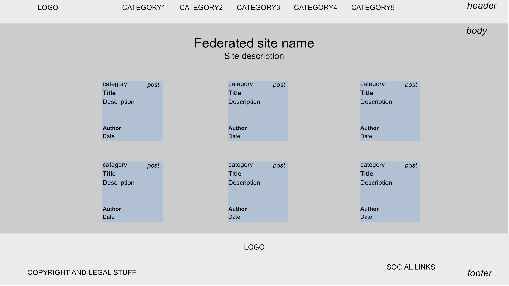

# Report: Large Coursework
### Bruno Enten

# Introduction
What is the essential story being told by your site and what type of structure
did you choose to implement.

blueTomorrow is an old school so called portal website, federating news about technologies related to the environment. The structure is flat, with a single, one level navigation.

# State 3 things that have inspired you when creating your website
* The name came from the ridiculous trend from the automotive industry to call their supposedly green technologies blue-something.
* This flat, minimalist design comes from everything produced by Tailwind CSS creators
* I was checking latest news from two of these federated websites when I had the idea for blueTomorrow. So thanks to vegconomist.com and insideevs.com for inspiration

# State 3 ways in which your site is accessible
* ARIA attributes allows usage of assistive devices
* Minimalist, high contrast design helps people with vision issues
* No paywall, which could discourage people with mental handicaps

# State 3 ways in which you have considered usability in your site.
* Design is minimalist and to the point. There are no redundant sections to distract users from the content
* Single, flat navigation. Every section is directly accessible through the top navigation links
* Using a lean CSS framework, tailwind, making for a responsive website, both in terms of performance and device support

# State 3 things you had to learn/find out by yourself when creating your site, and describe
* I had no prior knowledge of RSS feeds structure. I googled "RSS xml specs" and read the official specs
* I had never had to generate static files from a nextJS app before. I googled "generate static files from nextjs" and got the answer from the official documentation
* I didn't know how to pass whole objects as attributes to react components. I got it to work after reading the official documentation, and looking for a few SO examples.

# What aspect(s) of your work do you think worked well and why?
* Using tailwind allowed someone like me, with close to zero graphic design savviness, to produce a pleasant looking website.
* Using nextJS and starting from a template meant I had more time to work on the actual product, instead of wasting time on boilerplate code.

# What aspect(s) of your work could be improved, and how might you do things differently another time?
The way I handle the plethora of ways to structure a RSS feed is pretty bad at the moment. A separate library producing clean, standardized json from a bunch of mixed RSS structures would improve the aspect of each post.

# What resources were used when creating your work?
## Tailwind UI
The project was bootstrapped by starting from a nextJS / TailwindCSS template from TailwindUI
[TailwindUI salient template](https://tailwindui.com/templates/salient)
Various elements are sourced from TailwindUI components repository, then modified to suit the needs of the website.

## htmlToText
The RSS feed from one of the federated website contains html elements. To unify the content's format of all sources, I used this js lib to convert HTML to plain text.
[htmlToText](https://github.com/Sanchithasharma/htmlToText)

## Logo
I produced the logo by using a free icon from thenounproject, and the roboto font
[Bird by Douglas Gordon](https://thenounproject.com/browse/icons/term/bird)

## Privacy policy
Privacy policy generated and hosted for free, thanks to
[FreePrivacyPolicy](https://app.freeprivacypolicy.com/)

## RSS to JSON
The goal was to build a static website but at the same time I didn't feel like creating the actual content by myself. I fetched content from the RSS feeds of a few websites, and converted the result to JSON using [RSS to JSON converter](https://jsonformatter.org/rss-to-json)

## Content providers
Content of posts comes from these websites
* SOLAR [Renewable Energy World](https://www.renewableenergyworld.com/)
* MOBILITY [InsideEVs](https://insideevs.com)
* HVAC [ES Magazine](http://www.esmagazine.com)
* WATER [Watertech Research](https://www.watertechresearch.com)
* FOOD [Vegconomist](https://vegconomist.com)

## Aria tester
Used [Aria Tester](https://www.experte.com/accessibility) to check aria validity.
## Usual suspects
Of course I made heavy use of google, stack overflow, npm, ...

# Appendices
## Site Map
- Home
- Solar
- Mobility
- Heating / Cooling
- Water
- Food

## Wireframes and Mockups
### Home page

### Blog

## ARIA report
[PDF Report](blueTomorrow-aria-report.pdf)
One error was left as is intentionally to make the report more interesting.